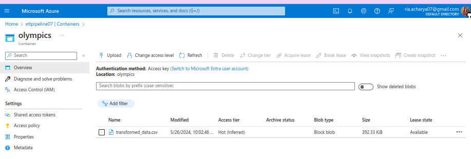

# Extract Transform Load (ETL)

The script facilitates the ETL process of Olympic data sourced from CSV files, utilizing Python for extracting, cleansing, and transforming the data. The transformed data is stored in a Data Lake. Azure Data Factory manages the transfer of data from the Data Lake to Azure SQL Database, where the processed data is stored for streamlined querying and analysis purposes.

## Introduction
ETL, which stands for Extract, Transform, Load, is a fundamental process in data management that involves three key steps. First, it extracts data from various source systems, which can include databases, cloud storage, and other data repositories. Next, it transforms this data by cleaning, enriching, and converting it into a suitable format or structure for analysis, ensuring data quality and consistency. Finally, the transformed data is loaded into a target database or data warehouse, where it is stored for future use in data analytics, business intelligence, and data science applications. The primary goal of the ETL process is to provide a comprehensive and unified view of data, facilitating easier and more accurate analysis and reporting from multiple sources.

## Pipeline Architecture


The pipeline architecture follows a typical  ETL (Extract, Transform, Load) process. Data is extracted from four CSV files: `Athletes.csv`, `Coaches.csv`, `EntriesGender.csv`, and `Medals.csv` using Python scripts. This raw data is then processed through a transformation pipeline where it undergoes cleaning, formatting, and enrichment to ensure consistency and relevance, resulting in a transformed dataset saved as `transformed_data.csv`. This transformed data is first stored in a Data Lake for scalable and durable storage. Subsequently, Azure Data Factory orchestrates the movement of this data from the Data Lake to an Azure SQL Database, facilitating efficient and reliable data loading. The final storage in Azure SQL Database enables seamless data retrieval and analysis, ensuring a robust, scalable, and efficient data processing pipeline.

## Tools 
- **Programming Language**: Python
- **Database**: Azure SQL Database

## Libraries
- **pandas**: Python library for data manipulation and analysis
- **azure-storage-blob**: A library providing access to Azure Blob storage
- **python-dotenv**: A library enabling loading environment variables 

## Infrastructure
- **Data Lake**: A scalable storage repository that allows the storage of structured and unstructured data in its native format, facilitating data analytics, processing, and sharing.
- **Data Factory**: A cloud-based data integration service provided by Azure, enabling the orchestration and automation of data movement and transformation workflows across various data sources and destinations.

## Installation

1. Clone this repository to your local machine

    ```bash
    git clone https://github.com/rheaacharya77/ETL-Olympics
    ```
2. Open your terminal and navigate to the project directory

    ```bash
    cd ETL-Olympics
    ```

3. Create a virtual environment using the following command
    
    ```bash
    python -m venv venv_etl
    ```

4. Activate the virtual environment

    - On Windows

    ```bash
    venv\Scripts\activate
    ```

    - On macOS and Linux

    ```bash
    source venv/bin/activate
    ```

5. Install the required packages using the provided requirements file

    ```bash
    pip install -r requirements.txt
    ```
    

## Azure Setup
- Azure Account: Ensure you have an active Azure account.
- Azure Resources: Create necessary Azure resources - Data Lake Gen2, Data Factory, Azure SQL Database.

## Usage

Create a file named .env in the project directory to add your Azure connection string with the following format:
```bash
AZURE_CONNECTION_STRING=your_connection_string_here
```

Navigate to the project directory in your terminal and run the following command to start the ETL process:

```bash
python main.py
```
This command will initiate the extraction of data from the CSV files, transform it as per the defined logic, and load the processed data into the Data Lake.

## Data Schema
The transformed data is organized into a single `olympics_unified` table.

- `Olympics_unified`: It stores detailed information about Olympic athletes, their achievements, and associated data. Below is a detailed definition of the table and its schema:

|Field             | Dtype  | Description                                                     |
|------------------|--------|-----------------------------------------------------------------|
| id               | int    | An auto-incrementing integer that serves as the primary key.    |
| Athlete          | varchar| The name of the athlete.                                        |
| Country          | varchar| The country the athlete represents.                             |
| Discipline       | varchar| The sport or discipline in which the athlete competes.          |
| Rank             | int    | The rank or position in the competition.                        |
| Gold             | int    | The number of gold medals won.                                  |
| Silver           | int    | The number of silver medals won.                                |
| Bronze           | int    | The number of bronze medals won.                                |
| Total_Medals     | int    | The total number of medals won.                                 |
| Total_Athlete    | int    | The total number of athletes competing per country.             |
| Coach            | varchar| The name of the coach associated with the athlete.              |

## Work Flow
### 1. Data Loading

Data are loaded from Csv files present at the data directory and then read into dataframe for further manipulation and analysis.


### 2. Data Cleaning And Transformation

Extracted data is processed and modified during this stage. Rows with any missing values are removed, and the text format of the Country, PersonName, and Name columns is standardized. Specific columns relevant to the final dataset are selected, and columns are renamed for better clarity and understanding. Duplicate rows are eliminated, and a new column, Id, is added to assign a unique identifier to each row. Finally, the desired column order is defined to increase efficiency.


### 3. Data Load

 The transformed data is then loaded into a Data Lake. This serves as a centralized repository for storing vast amounts of data.



Azure Data Factory is used to orchestrate the data flow from the Data Lake to the Azure SQL Database handling the scheduling, monitoring, and managing of data pipeline workflows.Data Factory pipelines are executed for this purpose.


The final destination for the transformed data is an Azure SQL Database, where it can be efficiently queried and analyzed.


## Future Enhancements

**1. Automated Data Validation**: Automated data validation checks can be implemented to ensure data quality and integrity throughout the ETL process.

**2. Real-Time Data Processing**: The pipeline can be developed to support real-time data extraction and processing, enabling more timely insights.

**3. Scalability Improvements:** Scalability improvements can be made to handle larger volumes of data, accommodating the growth of data sources and data size.

**4. Advanced Analytics:** Machine learning models for predictive analytics can be developed and incorporated to gain deeper data insights.

**5. Data Visualization:** Data visualization tools such as Power BI and Synapse Analytics can be integrated to create user-friendly dashboards and visual reports for better data analysis and interpretation.

## Conclusion
The ETL-Olympics project successfully implements an end-to-end data pipeline for processing Olympic data sourced from CSV files. Utilizing Python, the program efficiently extracts, cleanses, and transforms the data, storing it in a Data Lake for efficient data management. Azure Data Factory then orchestrates the transfer of data from the Data Lake to Azure SQL Database, enabling streamlined querying and analysis of the processed data. This project showcases the power of cloud-based data engineering solutions in handling complex data pipelines and extracting valuable insights from large datasets. This project highlights the value of data-driven decision-making in the realm of sports analytics.

## Contributing
Contributions are welcome! Here's how to contribute:

1. **Fork** the repo and **clone** your fork.
2. **Create a branch** for your changes.
3. **Make your changes** and **test** them.
4. **Commit** your changes with clear messages.
5. **Submit a pull request (PR)** with a detailed description of your changes.

Thank you for helping improve the Foodmandu Scraper!

